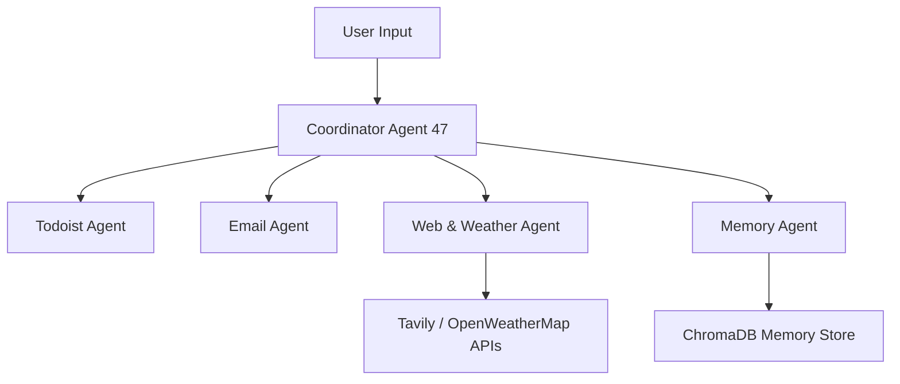

# Agent 47 - AI-Powered Multi-Agent Assistant


> **Agent 47** is a next-generation **AI assistant** powered by **multi-agent orchestration**, **real-time reasoning**, and **secure external integrations**.  
> It transforms conversational AI into an **action-oriented system** capable of performing real-world tasks such as managing emails, tasks, and live information retrieval.

---

## 🚀 Introduction

**Agent 47** represents a significant step forward in the evolution of intelligent assistants.  
Unlike traditional chatbots, this system integrates multiple specialized agents that collaborate to execute complex tasks seamlessly.

Through the use of the **Agno Framework**, **LLMs (Groq / DeepSeek V3)**, and **ChromaDB memory**, Agent 47 delivers context-aware, reliable, and secure automation.

---

## 🧠 System Overview

### Multi-Agent Architecture

| Agent | Responsibility |
|:-------|:----------------|
| **Coordinator (Agent 47)** | Central controller managing agent communication and task delegation |
| **Todoist Agent** | Manages tasks (create, read, delete) via the Todoist API |
| **Email Agent** | Reads and sends emails securely using Gmail IMAP/SMTP |
| **Web & Weather Agent** | Fetches live web and weather data using Tavily and OpenWeatherMap |
| **Memory Agent** | Stores and retrieves contextual information using ChromaDB |

---

## ⚙️ Core Technologies

| Technology | Purpose |
|:------------|:---------|
| **Python** | Core development language |
| **Agno Framework** | Multi-agent orchestration and workflow coordination |
| **Groq / OpenRouter (DeepSeek V3)** | LLM inference and task reasoning |
| **ChromaDB** | Vector database for persistent memory |
| **Streamlit** | Interactive user interface |
| **Todoist / Gmail / Tavily / OpenWeatherMap APIs** | External integrations |

---

## 🌟 Key Features

-  **Multi-Agent Orchestration** — Agents collaborate to execute multi-step reasoning and actions.  
-  **Chain-of-Thought Reasoning** — Each task is broken down and executed step-by-step.  
-  **Persistent Memory** — Stores user context and recalls relevant data automatically.  
-  **Email Management** — Securely reads, summarizes, and sends emails.  
-  **Task Automation** — Full Todoist integration for productivity workflows.  
-  **Web Intelligence** — Performs live research and retrieves weather data.  
-  **Secure Operations** — Environment variables, input validation, and permission control.

---

##  System Architecture



---

## 🧪 Testing & Validation

###  Functional Tests
- Task creation, update, deletion via Todoist API  
- Email read/send via Gmail  
- Weather and web data retrieval  
- Context persistence with ChromaDB  
- Complex multi-step reasoning tests

###  Security
- Protected environment variables  
- Sanitized user inputs  
- Scoped permissions  
- Controlled tool execution

---


##  Installation

### Prerequisites

Ensure you have:
- Python 3.10+  
- `pip` installed  
- Required API keys (Todoist, Gmail, Tavily, OpenWeatherMap)

### Setup

```bash
git clone https://github.com/homunculus86/codename_agent47
cd codename_agent47
streamlit run app.py

